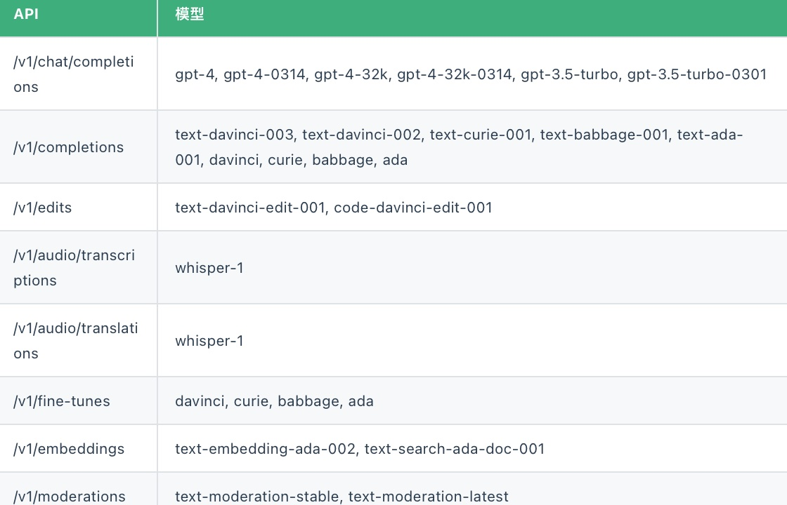
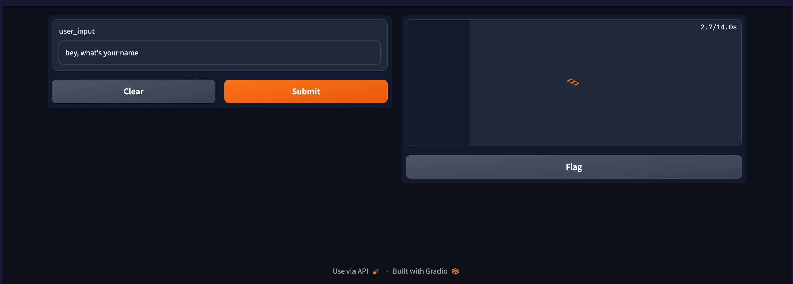

---
You can directly run the code by following my lead.
**How to concatenate the code?**  Copy every code block into cells in the ipynb if you don't know how to trans it into .py file.
## My configuration：
* vscode insiders==the newest version
* file format==ipynb
* python==3.8.10
* macos==Ventura 13.4.1
* gpt4=(need to purchase chatgpt plus or use others)

### Fake data sample here, just copy it and create a file named **data_output.csv**, then you don't need to prepare your data temporarily.

```
,Summary,Text,combined,embedding
0,Unlocking potential for Web3 creators,"""Unlike centralized platforms that take away creative freedom from content creators, Web3-friendly platforms aim to incentivize better content creation through a community-driven economy.""","[-0.004912093747407198, -0.03746252879500389, 0.004463960416615009]"
```

## To begin with, you need to make sure what you want.
You can do it later, this article is using **gpt-4** and **text-embedding-ada-002**
### choose your model for creating reponses

You can observe the tasks where these models excel in the first column, while the second column contains the specific models required for each task.

As you can see, audio means processing audio data. For this project, I'm using **gpt-4** for responsing and **text-embedding-ada-002** for embedding.

### complete your environments

this is the whole content of requirements.txt, you can create a file named **requirements.txt** and then put these lines into that.

```
openai
pandas
numpy
gradio==3.36
plotly
scipy
scikit-learn
pandas
```
## Run model within your own data(simply).

### import related modules

```python
import openai
import pandas as pd
import numpy as np
import gradio as gr
from openai.embeddings_utils import get_embedding, cosine_similarity
```

* **openai** is for passing your openai key and using the **embedding method** and **similarity computing**
* **pandas** is for reading and processing your data.
* **numpy** is needed for doing the embedding research.
* **gradio** is an easy deployed interface for interact with your model, btw you can share the public link with your coworkers for testing.


### retrieve data function completed

```python
def search_reviews(df, product_description, n=2):
    product_embedding = get_embedding(
        product_description,
        engine="text-embedding-ada-002"
    )
    df["similarity"] = df.embedding.apply(lambda x: cosine_similarity(x, product_embedding))

    results = (
        df.sort_values("similarity", ascending=False)
        .head(n)
        .combined.str.replace("Title: ", "")
        .str.replace("; Content:", ": ")
    )
    return (results.tolist())
```
Start from the **results** line, its my personal processing, I'll post my data sample at next part. You can see we invoke the embedding function here.

Parameters:
* **df** is the data file we give the engine from openai.
* **product_description** is user's question.
* **n** is how many entries you want it to return.


### use gpt-4 to get answers.

**Remember** to replace "xxxx" below with your own prompt.

```python
def get_answer(user_input):
    results = search_reviews(df, user_input, n=2)
    prompt = f"I'll give you two articles separated by double quotation marks, and I need you to answer the user question according to them. Here they are: {results}, and this is the user question: {user_input}"

    response = openai.ChatCompletion.create(
    model="gpt-4",
    messages=[
        {"role": "system", "content": "You are a helpful assistant to xxxx"},
        {"role": "user", "content": "xxxxx"},
        {"role": "assistant", "content": "xxxxx"},
        {"role": "user", "content": "xxxxxx"},
        {"role": "assistant", "content": "xxxxxx"},
        {"role": "user", "content": f"{prompt}"}
    ]
)
    return response['choices'][0]['message']['content']
```

### The last phase

**Remember** pass your own path and openai key here

```python
# Loading your data
datafile_path = "your data path here"
df = pd.read_csv(datafile_path)
df["embedding"] = df.embedding.apply(eval).apply(np.array) # type: ignore

# api key setup
api_key = "xxxxxxx"
openai.api_key = api_key

# Interface 
iface = gr.Interface(
    fn=get_answer,  
    inputs=gr.inputs.Textbox(), 
    outputs="text" 
)

# Build the interface
iface.launch()
```
Then you can input your query to test it. This is what you probably see.



*** Finished *** Happy for you.

But I suppose you need to fit your own data into the model, I'll tell you how to make it simply.

## how to process your own data
Assuming you probably have your own data in a dataframe file format. Go for some water and grab some snacks when waiting for the data embedding.

```
import pandas as pd
import tiktoken
from openai.embeddings_utils import get_embedding

# embedding model parameters
embedding_model = "text-embedding-ada-002"
embedding_encoding = "cl100k_base"  # this the encoding for text-embedding-ada-002
max_tokens = 8000  # the maximum for text-embedding-ada-002 is 8191

# load & inspect dataset
input_datapath = "your data path"  # to save space, we provide a pre-filtered dataset
df = pd.read_csv(input_datapath)
df = df.dropna()
df = df[["Summary", "Text"]]
df["combined"] = (
    "\"" + "Title: " + df.Summary.str.strip() + "; Content: " + df.Text.str.strip("") + "\""
)
df["Text"] = "\"" + df.Text.str.strip() + "\""
# you can check the sample by code "df,head(2)"


# Ensure you have your API key set in your environment per the README: https://github.com/openai/openai-python#usage

# This may take a few minutes, get you some water
df["embedding"] = df.combined.apply(lambda x: get_embedding(x, engine=embedding_model))
df.to_csv("your destination data path")

```
### The end
Your feedback matters to me. If you come across any mistakes or issues while browsing through the content, please don't hesitate to reach out. Please feel free to email me. Gmail:mianhuajidujing@gmail.com


### References:

[openai cookbook](https://platform.openai.com/docs/models/gpt-4)

[model docs](https://platform.openai.com/docs/models/gpt-4)