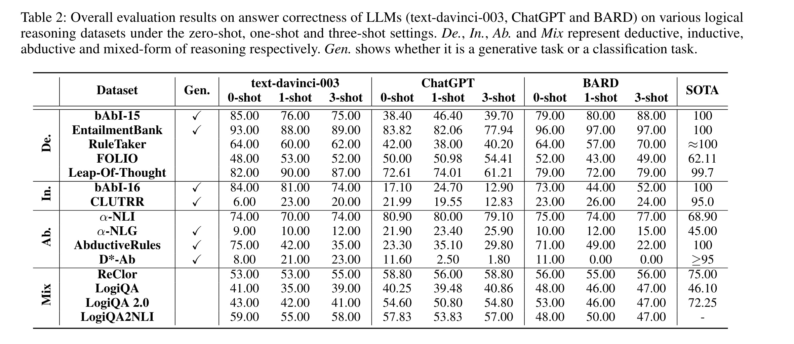
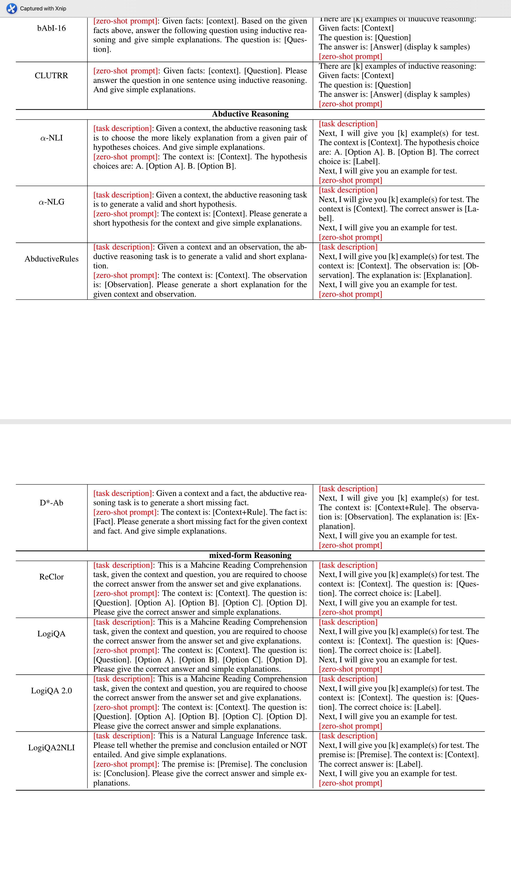
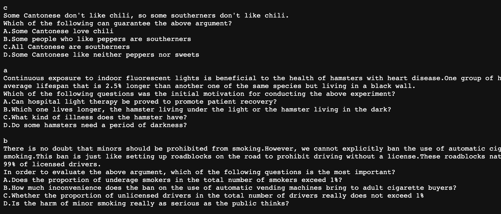

title: Paper notes about <Are Large Language Models Really Good Logical Reasoners?>
date: 2023-7-09
tags:
- Papers
categories: 
- Papers

---


# Paper: Are Large Language Models Really Good Logical Reasoners?


link:	[arxiv](https://arxiv.org/abs/2306.09841)

Authors'Info:
Fangzhi Xu1,2*, Qika Lin1,2*, Jiawei Han1,3, Tianzhe Zhao1,3, Jun Liu2,3†, Erik Cambria4 1 School of Computer Science and Techonology, Xi’an Jiaotong University 2 Shaanxi Provincial Key Laboratory of Big Data Knowledge Engineering 3 National Engineering Lab for Big Data Analytics 4 School of Computer Science and Engineering, Nanyang Technological University Leo981106@stu.xjtu.edu.cn, qikalin@foxmail.com, tara1208260223@stu.xjtu.edu.cn, ztz8758@foxmail.com, liukeen@xjtu.edu.cn, cambria@ntu.edu.sg


## Abstract

该研究旨在对大型语言模型（LLM）的逻辑推理能力进行全面评估，重点是演绎，归纳和演绎推理。作者选择了十五个典型的逻辑推理数据集, 他们分别在在zero-shot, one-shot, three-shot下评估了三个代表性的LLM（text-davinci-003，ChatGPT和BARD）。此外，他们还从客观和主观的角度提出了精细的评估，包括答案和解释。他们还引入了一个具有中性内容的新数据集，以衡量LLM的逻辑推理能力。最后从六个维度绘制了逻辑推理能力图，反映了LLM的优势和劣势，并提出了未来的发展方向。

## Introduction

本文认为有很少工作从逻辑推理的角度对LLM进行研究，所以他们打算从几个方面去评估LLM
分别是deductive, inductive and abductive三种方式的的推理 区别可点此链接查看：[deductive, inductive and abductive](http://factmyth.com/deductive-inductive-and-abductive-reasoning-explained/#:~:text=The%20core%20concepts%20to%20remember,guesswork%2C%20involves%20reasoning%20toward%20possible)

所有用于评估的数据集分为4类分别是deductive, inductive, abductive and mixed-forms。其次当前评估LLM的指标不够多和全面，最多就是一些矩阵比如精确度来衡量，由于类似chatgpt这种LLM是与人交户性比较强的工具，所以需要加上一些subjective性质的指标，包括：answer accuracy, explaination correctness, explaination redundancy and explaination completeness这四种。由于LLM容易学到bias，所以很多情况下逻辑推理会受到previous bias影响，导致其不是真正的逻辑论断，因此也想从中立内容这方面对其进行一个测试。最后他们得出了一个完善的评估系统，包括六个维度，分别是Correct, Rigorous, Self-aware, Active, Oriented and No Hallucination.

本文的一些贡献，大致是探索了LLM真正的逻辑推理能力，对逻辑推理能力的评估手段进行了一个系统性的升级，提供一些精细化而不是只用objective metrics的评估维度，提供了中立内容的数据集NeuLR。

## Preliminary
逻辑推理简单来说就是基于给出的一些前提premise然后推理出conclusion，打个比方rule: Children of eight years old are all in primary school. • fact1/premise1: Jordan is a child of eight years old. • fact2/premise2: Jordan is in primary school. 这三条我们可以用其中的两条推出剩余的一条。

首先deductive reasoning，可以理解为给出大前提，再给小前提就可以得出结论，比如说所有青少年都小于20岁（不严谨）+ 我是青少年， 即可得出：我小于20岁。作者说这是自上而下的 top-down

其次inductive reasoning，也就是归纳的意思，即从特殊的现象中得出一套泛化的结论，比如说：我是人 + 有些人是雄性，那么可以得出：我有可能是雄性。不确定是因为归纳推理本身就是probabilistic，不是certain的，作者认为这是自下而上的也就是bottom-up。

最后abductive reasoning，它也是probabilistic的，就是说从rule+一个前提得到一个可能性的结论，比如说我在上学 + 所有青少年都在上学，可以得出我可能是青少年，但是并不一定，所以abductive reasoning是和inductive reasoning的“可能性”特质很像的。


## Evaluation Details

这部分就是文本使用的一些待评估模型，数据集和测试指标。

* **评估模型**

首先是openai最早发布的LLM：text-davinci-003，然后是GPT-3.5-turbo，以及google的bard。

* **评估的数据集**

本文选取了15个逻辑推理常用的数据集并将它们做了划分（因为本文有四个task）

* **评估的指标**

有四个，我分别阐述一下

**Answer Correctness** 看生成的回答label是否为true，在生成式任务中只要意思相同就可以了，不需要token一致。

**Explanation Correctness** 这是一个主观的标准，就是看逻辑推理的过程中它的解释是否符合人的思维，能够合理的推断出结论

**Explanation Completeness** 我不太明白这个，但是大致的意思是正确答案能仅通过选中的facts推断出来

**Explanation Redundancy** 如其名就是逻辑推理的过程中被给到的facts太多了，比如说你两条facts就可以推断出这个结论但是我要用10条。


## Overall Experiments

实验结果的一些展示，先放图：

发现LLM在deductive reasoning方面做的比较好，inductive这方面的难度按理来说是最高的，另外few-shot上下文之间的学习并不一定能改善逻辑推理的能力，在其他非推理层面的NLP任务里反而是很有效果的。


## Fine-level Evaluations

最终各个模型在四个指标评估结果如下图，图脉络清晰我就不用文字加以赘述




## Are LLMs Rigorous Logical Reasoning?

思考LLM真的能严密的进行逻辑推理吗
引用原文的话“LLMs are best at keeping the rigorous reasoning in the abductive setting, while they are weak in the inductive setting”


## Are LLMs Self-aware Logical Reasoners?

生成式任务中LLMs回答的冗余度还是相对分类任务来说较高的，因为模型可以从多个维度去回答，

后续都是一些问题的回答，只不过都用数据作为答案展现出来了，比较多详情可点击论文查看。

## Conclusion

重述了一下之前强调本文使用的几个指标，衡量了几个任务，以及指出相应的逻辑推理包含的能力应该分为哪些。

最后根据结果，text-davinci-003可以在deductive 和 mixed-form模式中取得较均衡的成绩，inductive reasoning不太好，以及在abductive reasoning中lazy，从综合角度看，chatgpt表现较弱，但是它在避免幻想这个层面做的比较好，在保持理性方面做的较好，因为毕竟是chat tool，但是推理不太好。bard能力相对强，但是冗余度比较高，所以LLMs在逻辑推理能力方面还是有相应的局限性，以及现在评估逻辑推理能力的指标不够全面，有待做的事情还有很多。

## Future Directions

对未来的一些展望，比如加强薄弱点，也就是inductive reasoning的能力，提高LLM的认知边界，也就是老师说的cognitive science层面的东西，需要self-aware的能力，以及要适应真实世界的一些场景的问题等等。


## dataset

totally there are 15 datasets: and I'll summarize how are they constructed


* 部分数据集是在已发表研究的基础上构建的。比如LogiQA 1.0和2.0是在LogiQA的基础上新增了样本扩充而来。

* 部分数据集直接引用了已发表的研究论文中的数据集,比如bAbI-15和16、α-NLI等。

* 部分数据集像LogiQA2NLI是论文作者通过从其他数据集中筛选样本构建的。


下方列举一些数据集的样本： 比如说在logicQA dataset里

训练集验证集和测试集中每一条数据都是由空行+正确选择+背景+问题+四个选项构成
可以看出背景描述中都使用了逻辑连接词比如第一条‘so’，旨在训练模型逻辑推理的能力
下载详细数据可点击：[github/repo](https://raw.githubusercontent.com/lgw863/LogiQA-dataset/master/Train.txt)

构建的方法揣测：

* 基于语料库从大规模语料库中抽取自然语言语句，使用自然语言推理模型预测句子间的逻辑关系,生成句子对人工检查过滤关系预测错误的样本
* 基于知识图谱从知识图谱中提取实体和事实三元组,转换为自然语言描述，抽取且转换两三元组,构建含有逻辑关系的句子对人工检查过滤无意义的样本

## 关于四个指标如何衡量及具体例子
* Answer Correctness:

```
前提:猫和狮子都属于猫科动物
问题:老虎属于猫科动物吗?
回答:是

判断:老虎属于猫科,回答正确
```
可以由模型自动判断生成回答的正确性,与ground truth对比。


* Explanation Correctness:

```
前提:兔子是噪音动物,噪音动物都是扁平头骨动物
问题:兔子是否扁平头骨?
解释:兔子属于噪音动物,噪音动物属于扁平头骨动物,所以可以推断兔子是扁平头骨。

判断:基于知识图谱关系的合理解释。
```
这里可能是作者团队人为根据解释是否符合人类逻辑推理进行打分，因为该评价指标为subjective，但是在论文中我没有找到明确说明的地方。


* Explanation Redundancy:

```
前提:猫是肉食性动物,猫吃老鼠,猫有尖锐爪牙。
问题:猫的食物是什么?
解释:猫是肉食性动物,猫是肉食性动物,猫吃老鼠......

判断:重复提到“猫是肉食性动物”,存在冗余
```
可以通过自动方法检测重复前提,进行冗余判断。
例如基于注意力机制或匹配网络判定重复。


* Explanation Completeness: 

```
前提:鲸鱼属于海洋哺乳动物
问题:鲸鱼的生存环境是?
解释:鲸鱼属于哺乳动物。

判断:缺少“海洋”关键信息,解释不完整。
```

可以使用问答模型或信息检索自动判断解释是否可从前提完整推导。


## 与HRM的联系
### 区别:

研究动机不同

* “Are LLM Really Logical Reasoners”专注评估LLM的逻辑推理能力
* “Human Reasoning Module”提出一种增强LLM逻辑推理的方法

评估数据集不同

* 前者使用多样化的逻辑推理数据集
 
方法不同

* 前者只评估模型现有能力
* 后者提出了人类推理模块来增强模型


### 共同点：

* 都关注提高LLM的逻辑推理能力

* 都构建了特定的评估数据集

* 都从理性和一致性等方面分析模型输出

* 都validation了模型在逻辑推理任务上的局限性

* 都提出了未来增强模型逻辑推理的方向


## HRM数据集和该论文数据集对比

### **重新介绍HRM的数据集：**
### 推理任务模型

这个模型使用的数据集来自Cummins等人的研究,包含16个因果关系句子,以及对应4种论证形式的样本,例如:

```
句子:"如果踩下刹车,汽车会减速。"

论证形式:
Modus Ponens:"踩下了刹车,因此汽车减速了。"
Modus Tollens:"汽车没有减速,因此刹车没有被踩下。"
```


### 空间关系任务模型
这个模型使用的样本为判断两个物体间关系的空间推理题。例如:

```
前提1:B 在 A 的右边
前提2:C 在 B 的左边
问题:D和E之间的关系是?
```

### 贝叶斯推理任务模型
该模型使用"栓片"(blicket)实验中的样本。给出一些木块,判断哪些是"栓片",具有让检测器激活的因果能力。例如:

```
训练阶段:
块A放在检测器上,检测器激活。
块B放在检测器上,检测器未激活。

测试阶段:
块C放在检测器上,检测器激活。
判断块C是否为"栓片"?
```


### 对比HRM论文和LLM论文使用的数据集,我的理解是:


* 数据集规模不同


HRM论文的模型验证数据集规模相对更小。例如第一个模型只使用了16个样本。

LLM论文使用了更大规模的公开逻辑推理数据集,一共15个,每个大约数百个样本。

* 数据集构建不同


HRM论文中的样本来源于相关的心理学实验研究。

LLM论文使用的大部分是已发表的数据集。

* 数据集范围不同


HRM论文使用的样本类型窄一些,每篇只关注一类推理。

LLM论文数据集涵盖演绎、归纳和假说等多类型推理。

* 覆盖不同维度


HRM论文数据集更侧重推理过程。

LLM论文数据集侧重结果的正确性。

* 评估目标不同


HRM论文数据集用于评估认知过程建模的符合度。

LLM论文数据集用于直接评估模型推理能力。

总体来说,HRM论文中使用的数据集更小规模、窄范围,但提供了丰富的过程信息,适合评估认知模型。LLM论文数据集则更大规模、综合,侧重结果评估,适合直接判断模型能力。两者服务于不同的研究目的。


