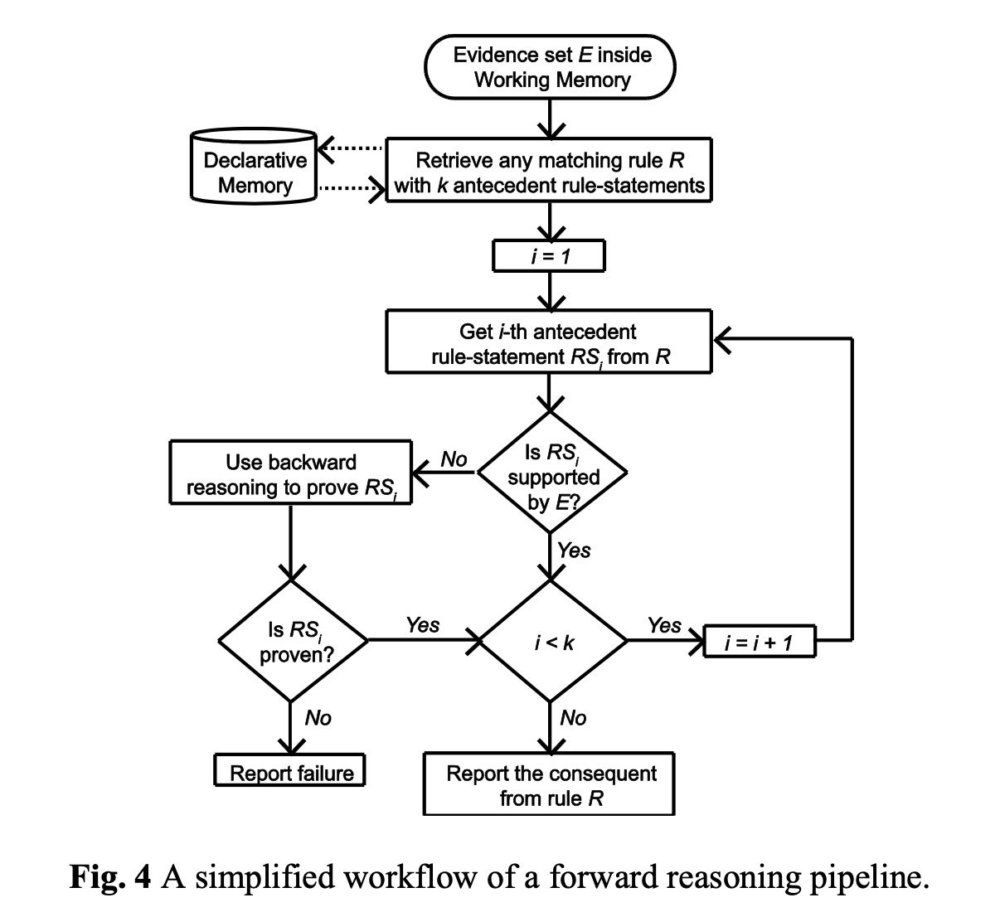
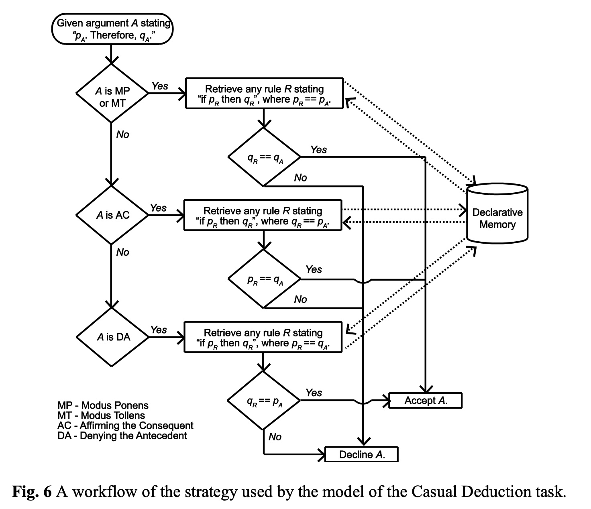

---


# Paper: Human Reasoning Module


link:	[human reasoning module](https://citeseerx.ist.psu.edu/viewdoc/download;jsessionid=32CFA430A83B3069A4239DEB74F04FAB?doi=10.1.1.714.1165&rep=rep1&type=pdf)

Authors'Info:
Enkhbold Nyamsuren (e.nyamsuren@rug.nl) Department of Artificial Intelligence, University of Groningen, Nijenborgh 9, 9747 AG Groningen, Netherlands
Niels A. Taatgen (n.a.taatgen@rug.nl) Department of Artificial Intelligence, University of Groningen, Nijenborgh 9, 9747 AG Groningen, Netherlands


## Abstract
这篇文章介绍了一种叫“Human Reasoning Module (HRM)”的框架，这是基于ACT-R实现的，ACT-R是一种人类认知结构的理论，这种认知模型可以预测诸如“学生思考算数问题的过程中，神经影像会展现出哪些活跃的部分”，详情可以参考此视频 [Adaptive Control of Thought – Rational ACT- R By: John R. Anderson](https://youtu.be/5_RqQ56MxPE)，而HRM可以简单理解为是ACT-R理论的computer simulation，同时也是对ACT-R理论的一个extension及工具实现 具体的几个模型如何工作和实现的再往下看.


## Introduction
HRM的程序性知识结构定义了人类逻辑的语法，公理模式和推理规则等，HRM是基于知识块的，并且主张通过previous experience和real-time info推理并解决问题. 接下来就是HRM试图去解决的关于human reasoning的几个方面：

* **Inductive and deductive reasoning**

	作者觉得人的推论应该是probabilistic的，也就是不能是确定性的fact，没有被世界证明正确的未必是不正确的，保持开放然后去追求truthfulness而不是该推论的falstiy


* **Mental logic, mental models and bottom-up reasoning**
	
	作者认为人类推理综合来看并不一定是自上而下的意识性的正式思考，心智逻辑和心智模型的理论百家争鸣，作者不排除这些理论的兼容性，也就是都为其所用，然后这个visual short-term memory (VSTM)就是自下而上的一种推理形式，可以说是动用了底层的人脑注意力，并不是一种归纳推理和其他推理形式。	

* **Deterministic and probabilistic inferences**

HRM引入了一种简单有效的reasoning pipeline方式解决一些可能存在的冲突，基于视觉短时记忆推理的优先级比基于陈述性知识更高.

## Architecture of the HRM
* **Knowledge representation in declarative memory**
主要介绍了一下元组的表现形式和一些概念的定义设计

* **Schema and inference types**
这个部分介绍了一下HRM采用了条件推理模式，同时设计了一些推理的规则，比如下方给出条件，假设成立，再看deduction是否make sense.


* **Backward reasoning pipeline**
推理的pipleline如下，也就是说采用的手段优先级从高到低排列为：自下而上推理>声明性检索>自上而下推理


* **Forward reasoning pipeline** 

这里是讲HRM如何基于用户提供的query去检索相关规则并推理，这里的前向推理管道是基于用户提供的查询语句，从声明性内存中检索与查询语句匹配的前提规则，并根据多个标准选择规则。然后HRM使用这些规则进行推理，从而生成结论或推断.


## Validation Models
Validation Models部分介绍了三个不同的实验任务模型，每个模型都用于复制人类行为，并根据人类表现数据进行验证。这些模型的目的是验证HRM的推理能力和有效性。

第一个模型是一个简单的推理任务模型，用于演示HRM基于声明性内存中的推理规则的基本推理能力。该模型仅使用声明性知识，不需要其他模块，如视觉。该模型使用的推理策略仅限于声明性规则的检索。该模型演示了即使在简单的推理任务中，竞争和冲突的声明性知识也会影响结果的重要性。它显示了在任何逻辑推理任务中考虑声明性检索结果的不确定性的重要性。

第二个模型是一个分类任务模型，用于演示HRM如何使用前向和后向推理来解决分类问题。该模型使用了视觉模块和声明性模块，以模拟人类在分类任务中的行为。该模型演示了HRM如何使用前向和后向推理来解决分类问题，并且可以在不同的分类任务中进行扩展。

第三个模型是一个因果推理任务模型，用于演示HRM如何使用因果推理来解决因果关系问题。该模型演示了HRM如何使用因果推理来解决因果关系问题，并且可以在不同的因果推理任务中进行扩展。

* **Model of Casual Deduction Task**
这里假设我们提供一个描述因果关系的句子，例如"If <cause>, then <effect>"。然后HRM会从声明性内存中检索与这个句子匹配的前提规则，并根据多个标准选择规则。接下来HRM使用这些规则进行推理，来生成结论或推断。
这里就是第一个模型的工作流程，可以看出来是在四种逻辑形式Modus Ponens (MP)，Modus Tollens (MT)，Affirmation of the Consequent (AC)，和Denial of the Antecedent (DA)里做选择然后检索相应的规则。


* **Model of Spatial Relations Task**

简单概括一下这个部分模型处理的过程：

1. 前提处理：模型首先接收四个前提，这些前提描述了物体之间的关系。模型使用这些前提来构建心理状态或形象，以表示前提中的物体。

2. 心理状态构建：模型通过迭代地处理每个前提，逐步构建心理状态。在处理每个前提时，模型使用抽象对象来表示物体，并根据前提中的信息更新心理状态。

3. 空间关系推导：通过构建好的心理状态，模型可以直接推导出两个查询物体之间的空间关系。模型利用心理状态中的信息来确定物体之间的关系，从而回答查询问题。

* **Model of Bayesian-like Inference in Blicket Task**

模型的推理策略：模型使用前向推理和后向推理相结合的方式进行推理。在前向推理中，模型根据观察到的方块放置情况和先前的知识进行推断。在后向推理中，模型根据观察到的结果和先前的知识来推断方块的属性。前向推理的步骤：模型首先根据观察到的方块放置情况进行前向推理。

## Discussion and Conclusion
模型的良好拟合结果挑战了人类推理中确定性和概率推理之间的传统垂直分割观点。鉴于人类记忆的不一致性和召回的不确定性，确定性推理可以变得具有概率性。这种模型的拟合结果对于我们理解人类推理过程中的底层认知过程提供了详细的解释。HRM展示了人类思维展示的不同推理面向的单一系统。作为认知架构的一部分，HRM有望成为探索人类思维深处和生物启发的有用的工具。


```

```
